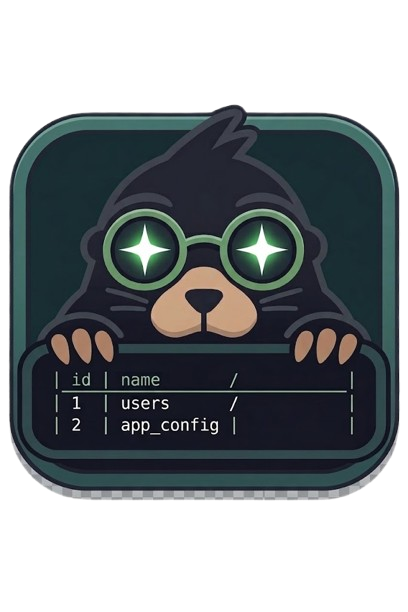

<p align="center">
  
</p>

# relm

Terminal database browser. Explore, query and edit databases from the keyboard, without leaving your terminal.

Supports exactly **five engines**: SQLite, PostgreSQL, MySQL, MariaDB and SQL Server — and no more.

> **First time?** `relm` does not start servers: it connects to databases that already
> exist (a `.db` file for SQLite, a server for the rest). Follow the step-by-step
> guide in **[USAGE.md](USAGE.md)** — how to create a test database, connect
> for the first time and run queries.

## Installation

Requires Go 1.26+. No CGO or gcc needed: the SQLite driver is the pure-Go
`modernc.org/sqlite`.

```bash
go install github.com/agmonetti/relm@latest
# or from the repo:
go build -o relm ./cmd/relm
```

## Usage

```bash
relm
```

The **connection screen** opens. Pick the engine with `←`/`→`, fill in the fields and press `Enter` to connect. For SQLite you only need the file path.

### Shortcuts

| Key | Action |
|---|---|
| `Ctrl+C` / `q` | Quit |
| `Ctrl+N` | New connection |
| `Ctrl+S` | Save connection (connection screen) |
| `Ctrl+P` | Settings (query timeout) |
| `Tab` | Move focus to the next pane (sidebar → main → editor) |
| `Alt+1` / `Alt+2` / `Alt+3` | Jump to sidebar / main / editor |
| `i` | View the active table structure (main pane) |
| `v` | Row detail: full values of the selected row |
| `Enter` (sidebar) | Open the selected table in the main pane |
| `↑↓` / `k j` | Navigate rows (main) or tables (sidebar) |
| `PgUp` / `PgDn` | Change page |
| `r` | Refresh table |
| `Alt+B` | Show/hide sidebar |
| `Ctrl+R` | Run query (in the editor) |
| `Esc` (while running) | Cancel the running query |
| `Ctrl+L` | Clear editor input |
| `↑↓` (in editor) | Navigate query history |
| `?` | Help (`Esc` to close) |
| right-click drag | Resize panes (sidebar / editor) |
| click | Focus / select a row |
| wheel | Scroll the pane under the pointer |

## Features

- Single-window TUI: sidebar, browser/main and SQL editor are always visible
  in separate panes with visible borders; `Tab` / `Alt+1..3` move the focus.
- Auto-refresh: after a write query (INSERT/UPDATE/DELETE/CREATE/...) the
  sidebar and the open table are reloaded automatically.
- Stable table browser with keyset pagination over the primary key (with an
  OFFSET fallback for tables without a single-column PK), so refreshing never
  moves the visible rows.
- Multiline SQL editor with history of the last 100 queries. Queries run in the
  background with a configurable timeout (`Ctrl+P`) and can be cancelled with
  `Esc` while running.
- Table structure: columns, constraints and indexes.
- Saved connections in `~/.config/relm/connections.json`; preferences (query
  timeout) in `~/.config/relm/prefs.json`.
- `Read-only` mode for SQLite and `SSL` field for PostgreSQL (see `06-security.md`).
- NULL is shown as `∅`; long values are truncated with `…`.
- No server, no prior configuration, a single binary.

## Development

```bash
go test ./...        # tests
go vet ./...         # static lint
go run ./cmd/relm    # run
```

`relm --print-layout` prints the connect screen and a sample workspace as plain
text (with the terminal size the app detects) — useful to report layout bugs
from any terminal.

### Network engine tests

The PostgreSQL/MySQL/MariaDB/SQL Server tests are integration tests and are
skipped unless the corresponding env var is set. Start the servers
with the included compose and point the tests at them:

```bash
docker compose up -d

SQLISH_TEST_POSTGRES_HOST=localhost SQLISH_TEST_POSTGRES_USER=postgres SQLISH_TEST_POSTGRES_PASSWORD=postgres SQLISH_TEST_POSTGRES_DATABASE=test \
SQLISH_TEST_MYSQL_HOST=localhost    SQLISH_TEST_MYSQL_USER=root        SQLISH_TEST_MYSQL_PASSWORD=root        SQLISH_TEST_MYSQL_DATABASE=test \
SQLISH_TEST_MARIADB_HOST=localhost  SQLISH_TEST_MARIADB_USER=root      SQLISH_TEST_MARIADB_PASSWORD=root      SQLISH_TEST_MARIADB_DATABASE=test \
SQLISH_TEST_MSSQL_HOST=localhost    SQLISH_TEST_MSSQL_USER=sa          SQLISH_TEST_MSSQL_PASSWORD='Str0ng!Passw0rd' SQLISH_TEST_MSSQL_DATABASE=master \
go test ./...
```

## Stack

Go 1.26+, bubbletea + lipgloss + bubbles (Charmbracelet), drivers:
`modernc.org/sqlite`, `jackc/pgx/v5`, `go-sql-driver/mysql`, `microsoft/go-mssqldb`.

## Design documentation

The spec lives as numbered documents in this directory:

| File | Contents |
|---|---|
| `00-guide.md` | Core idea (5 engines) and reading order |
| `01-vision.md` | Vision, non-negotiable principles |
| `02-architecture.md` | Layers, `Store` interface, dialects per engine |
| `03-ux-screens.md` | Screens, keymaps, styles |
| `04-implementation.md` | Implementation phases |
| `05-technical-decisions.md` | DSNs, edge cases, dialects |
| `06-security.md` | Threat model and security decisions (maintainers) |
| `07-user-security.md` | Security for the end user |
| `LESSONS.md` | Agent decisions during development |

For the step-by-step usage guide, see [USAGE.md](USAGE.md).
