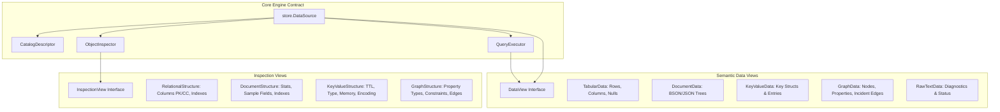
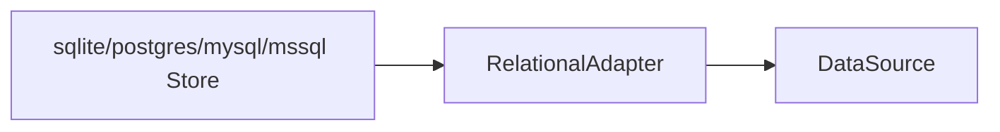

# 01 — Architecture: Composable Capabilities & Semantic Data Views

## 1. Overview and Core Philosophy

`relm`'s architecture evolves from a table-centric model to a **multi-paradigm data browser** architecture founded on three strict principles:

1. **No Semantic Falsehoods**: Never call MongoDB collections, Redis keys, or Neo4j labels "tables". Never invent fake columns for key-value stores.
2. **No Result God Objects**: The result of an operation is not a sprawling struct with optional fields for every database. It is a self-describing, typed `DataView`.
3. **No Scattered Driver Switches**: Engine-specific protocols are encapsulated in engine packages. The TUI consumes composable capabilities (`CatalogDescriptor`, `QueryExecutor`, `InspectionView`, `DataView`).

---

## 2. Architecture Comparison

### Rejected: Design A (Universal Store)
```go
// ANTI-PATTERN: Forcing all paradigms into relational methods
type Store interface {
    Tables() ([]string, error)
    Columns(t string) ([]Column, error)
    CountTable(t string) (int, error)
    SelectTablePage(t string, limit, offset int) (*Result, error)
}
```
*Rejected because non-relational engines are forced to implement fake stubs or return invalid semantics.*

### Rejected: Design B (Rigid Paradigm Split)
```go
// ANTI-PATTERN: Proliferation of rigid parallel store hierarchies
type RelationalStore interface { ... }
type DocumentStore interface { ... }
type KeyValueStore interface { ... }
type GraphStore interface { ... }
```
*Rejected because it forces duplicate TUI controllers and breaks multi-model extensibility.*

### Selected: Design C (Composable Capabilities & Semantic Data Views)


---

## 3. Core Types and Interfaces (`internal/store`)

### `DataSource` Contract
```go
package store

type DataSource interface {
    Driver() conn.Driver
    Version(ctx context.Context) (string, error)
    Close() error
    ReadOnly() bool

    // Catalog returns the primary navigation hierarchy and entity descriptor.
    Catalog() CatalogDescriptor

    // Browse fetches a page of data for a specific catalog object.
    Browse(ctx context.Context, req BrowseRequest) (BrowseResponse, error)

    // Inspect returns the structural description or schema of an entity.
    Inspect(ctx context.Context, objectName string) (InspectionView, error)

    // Query returns the engine's query executor.
    Query() QueryExecutor
}
```

### `CatalogDescriptor` & Navigation
```go
type CatalogDescriptor struct {
    Title       string // "TABLES", "COLLECTIONS", "KEYS", "LABELS"
    ItemNoun    string // "table", "collection", "key", "label"
    ListObjects func(ctx context.Context) ([]CatalogItem, error)
}

type CatalogItem struct {
    Name     string // Identifier (e.g. "users", "user:1000", "Product")
    Badge    string // Type badge (e.g. "hash", "set", "zset" in Redis)
    Metadata string // Optional summary (e.g. count or size)
}
```

### Semantic `DataView` Hierarchy
```go
type DataView interface {
    dataView()
    Summary() string
    IsEmpty() bool
}

// TabularData: For relational tables, Cassandra CQL rows, and SQL query projections
type TabularData struct {
    Columns   []string
    Rows      [][]string
    Nulls     [][]bool
    Affected  int64 // >= 0 for write statements, -1 for read queries
    Truncated bool
    TotalRows int64 // -1 if unknown or unbounded
}

// DocumentData: For MongoDB collections and JSON document queries
type DocumentData struct {
    Documents []DocumentItem
    TotalDocs int64
}

type DocumentItem struct {
    ID      string
    Summary string // Single-line preview
    RawJSON string // Pretty-printed indented JSON
}

// KeyValueData: For Redis keys and data structures
type KeyValueData struct {
    Key      string
    Type     string            // "string", "hash", "list", "set", "zset", "stream"
    TTL      string            // "-1 (no TTL)", "847s", "expired"
    Metadata map[string]string // Memory usage, encoding, length
    Entries  []KVEntry
}

type KVEntry struct {
    Index string // Hash field, list index (0, 1..), or rank
    Value string // Value or member string
    Extra string // e.g. ZSet score, stream timestamp
}

// GraphData: For Neo4j nodes, relationships & Cypher results
type GraphData struct {
    Nodes []GraphNode
    Edges []GraphEdge
}

type GraphNode struct {
    ID         string
    Labels     []string
    Properties map[string]string
    Incident   []GraphEdgeSummary // Inbound/outbound edges
}

type GraphEdge struct {
    ID         string
    Type       string // e.g. "PURCHASED"
    StartNode  string
    EndNode    string
    Properties map[string]string
}

type GraphEdgeSummary struct {
    Direction     string // "->" (outgoing), "<-" (incoming)
    Type          string // "PURCHASED"
    TargetID      string // "Product #42"
    TargetSummary string
}

// RawTextData: For commands, INFO, stats, error descriptions
type RawTextData struct {
    Title string
    Text  string
}
```

### Native `InspectionView` Hierarchy
```go
type InspectionView interface {
    inspectionView()
    Title() string
}

type RelationalStructure struct {
    Columns []Column // With PK bool and Clustering bool
    Indexes []Index
}

type DocumentStructure struct {
    CollectionName string
    DocCount       int64
    AvgSize        int64
    TotalSize      int64
    IndexSize      int64
    Indexes        []Index
    SampleFields   []FieldSchema
}

type KeyValueStructure struct {
    Key        string
    Type       string
    TTL        string
    Encoding   string
    MemUsage   int64
    Length     int64
    ServerInfo map[string]string
}

type GraphStructure struct {
    LabelName     string
    Properties    []FieldSchema
    Constraints   []string
    Indexes       []Index
    Relationships []string
}
```

### `QueryExecutor`
```go
type QueryExecutor interface {
    Language() string         // "sql", "mql", "redis", "cql", "cypher"
    PromptTitle() string      // "SQL EDITOR", "MONGO QUERY", "REDIS COMMAND", "CQL EDITOR", "CYPHER EDITOR"
    Placeholder() string      // Contextual placeholder snippet
    Execute(ctx context.Context, buffer string, line int, maxRows int) (DataView, error)
    IsMutation(statement string) bool
}
```

---

## 4. The Relational Migration Adapter

To avoid rewriting existing relational implementations (`SQLiteStore`, `PGStore`, `MySQLStore`, `MSSQLStore`), `relm` preserves the internal `Store` interface and wraps it in a shared `RelationalAdapter`:



- **`Catalog()`**: Queries `legacy.Tables()` → returns `CatalogDescriptor{Title: "TABLES", ItemNoun: "table"}`.
- **`Browse()`**: Translates `BrowseRequest` to `legacy.SelectTableKeysetPageContext` or `SelectTablePageContext` → returns `*TabularData`.
- **`Inspect()`**: Queries `legacy.Columns()` and `legacy.Indexes()` → returns `*RelationalStructure`.
- **`Query()`**: Splits SQL statements, calls `legacy.QueryContextMax` / `ExecContext` → returns `*TabularData`.

All dialect identifier quoting, keyset ordering, and schema SQL queries are preserved 100% untouched.

---

## 5. Extensibility Validation (Stress Test with Hypothetical Engines)

To prove that the architecture is not overfit to the 9 current engines, consider integrating hypothetical future databases:

### Elasticsearch / OpenSearch
1. **Catalog**: Lists indices (`_cat/indices` → `CatalogDescriptor{Title: "INDICES", ItemNoun: "index"}`).
2. **Browse**: Queries `_search` → returns `*DocumentData` with raw JSON document `_source`.
3. **Inspect**: Queries `_mapping` → returns `*DocumentStructure`.
4. **Query**: Executes JSON Query DSL or ES|QL → returns `*DocumentData` or `*TabularData`.
5. **Core Code Changes**: **ZERO**.

### DynamoDB
1. **Catalog**: Lists tables (`ListTables` → `CatalogDescriptor{Title: "TABLES", ItemNoun: "table"}`).
2. **Browse**: Queries `Scan` / `Query` → returns `*DocumentData` or `*TabularData`.
3. **Inspect**: Returns Partition Key, Sort Key, GSI/LSI definitions.
4. **Query**: Executes PartiQL (`SELECT * FROM "Orders"`) → returns `*DocumentData`.
5. **Core Code Changes**: **ZERO**.
